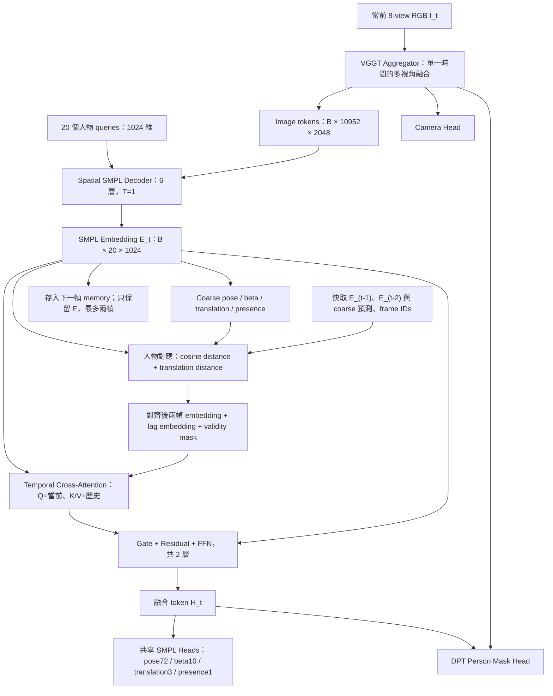

# 舊版：兩幀 person-token memory（非目前 config）

此文件保留 2026-09-15 的 latent-token 架構與測試紀錄。現行 config 已改為 GT
身體參數 encoder，請見 [目前架構](smpl_embedding_memory.md)。本文件的 config 指令
不再代表現行設定。

## 任務與架構

使用當前多視角影像，以及前兩幀獨立生成的每人 SMPL embedding，輸出當前 SMPL。
`training/config/mamma_smpl_embedding_memory.yaml` 繼承原本混合資料 config 的模型尺寸與
SMPL-X / camera / DPT mask / temporal motion loss 設定；資料來源改為本機 `mamma_compose`，
train/val 以 sequence 分割。原 config 的行為不變。



518 / 14 = 37，所以每個視角有 1369 個 patch，八視角共 10952 個。
SMPL embedding 是參數回歸前的 `person_tokens`；不是 mask head 的 128 維投影，
也不是將已預測的 SMPL 參數重新編碼。

## 模組設計原因

| 模組 | 設計原因 |
| --- | --- |
| Frozen VGGT Aggregator | 保留既有多視角觀測能力；先訓練 SMPL、memory、camera 與 mask heads。時間始終折進 batch，aggregator 不跨時間。 |
| Spatial decoder | 沿用原 relative temporal decoder 的參數名稱與尺寸，但每次只解碼 T=1。所有空間 embedding 都不含其他時間的影像，能安全快取。原 decoder 的六層 singleton self-attention / zero-offset relative bias 保留以載入 checkpoint。 |
| 預測式人物對應 | 對每個 history frame 做一對一 Hungarian 配對，cost 是 embedding cosine distance + 0.25 × translation distance。人物存在信心、最大距離與最大 cost 排除不可信歷史，dummy columns 允許 unmatched。不能假設相同 query index 就是同一個人。 |
| 時間編碼與 validity | 兩個 learned lag embeddings 分別代表相差 1、2 個 frame。無效人物、超過兩幀、缺幀不會假裝有歷史。訓練另有 0.1 history dropout，模擬漏檢。此版本使用 frame index，要求固定 FPS；混合 FPS 時需先重採樣或擴充成時間戳編碼。 |
| Temporal attention | 每人只讀取對應的兩個歷史 token，避免重新保留歷史的全圖 patch tokens。兩層 attention 是初始設計，改善效果須靠 ablation 評估。 |
| Gate + residual | gate 接收當前 token、attention 結果與兩個有效 presence 分數，初始 bias=-2。歷史為空時整個 layer 精確回退 spatial token，null key 防止全遮罩 attention 的 NaN。presence 只是存在信心，不等同姿態品質。 |
| Shared SMPL heads | spatial E 與 refined H 透過相同輸出層接受監督，讓 E 可解碼人體資訊；輸出介面與舊 loss 一致。 |
| DPT mask / camera | H 與當前多尺度視覺特徵產生人物 mask；camera 由當前影像決定。保留原本的幾何與分割監督。 |

人物對應是 memory retrieval，不是完整長時間 tracker：兩個歷史 frame 分別對應當前
frame，沒有永久 track ID，也不會保留超過兩幀的遮擋人物。訓練與推論皆只使用預測
資訊做 memory matching，沒有輸入 GT 身分或 GT pose 的 train/inference 落差。
若模型初期 coarse predictions 很差，valid history 可能偏少；請監看
`smpl_memory_valid_fraction`，並以 pretrained checkpoint 起訓。

## Loss

```text
L_total = L_refined_multitask + 0.25 * L_spatial_SMPL
```

- `L_refined_multitask`：沿用原有 camera、SMPL pose、beta、joints2d、joints3d、vertices、
  mesh translation、presence、DPT mask loss，及 GT-relative temporal motion loss。
- `L_spatial_SMPL`：對每一幀 E 的 coarse predictions 使用原有 SMPL 幾何與 presence
  監督（同組權重），不重複加 camera、mask 或 temporal loss。Spatial Hungarian
  matching 使用 pose / beta / translation / presence，不使用不存在的 coarse mask。
- Temporal pose 權重 0.05：比較預測和 GT 的局部關節相對 SO(3) 運動。
- Temporal root 權重 0.02：比較 root 的相對 SO(3) 運動。
- Temporal translation 權重 0.05：比較預測位移和 GT 位移。
- Temporal beta 權重 0.01：同一人物體型的一階一致性。
- GT matching 只在 loss 中使用。既有 loss 先把各幀預測對齊 dataset 的人物順序，再算 motion；
  人物缺失會由 `has_smpl` 遮罩排除。

訓練回傳 `[B*T,P,...]`，各幀依序使用 0、1、2 幀歷史，各 causal prediction 都有監督，
不是只監督最後一幀。推論取當前輸出即可。clip 長度 3、stride 1；shuffle 只打亂完整
clip，不會讓不同 batch 共享狀態。`temporal_detach_history: true` 切斷歷史 token 的
refinement 梯度，但 spatial auxiliary loss 仍會訓練其 encoder；設為 false 可做 clip 內
端到端反傳。沒有將 fused H 寫回 memory，因此特徵的時間範圍確實限於兩幀。

## 訓練

在 repo root 使用原訓練入口：

```bash
CUDA_VISIBLE_DEVICES=2 PYTHONPATH=.:training \
PYTORCH_CUDA_ALLOC_CONF=expandable_segments:True \
/mnt/train-data-5-hdd/yian/anacond/envs/mamma/bin/torchrun \
  --standalone --nproc_per_node=1 training/launch.py \
  --config mamma_smpl_embedding_memory
```

Config 內本機 compose、checkpoint、SMPL-X 路徑需在其他機器上調整。目前預設 B=5、T=3、
V=8、518px、20 queries。checkpoint 中原有權重可沿用；只有新 memory layers 和
time embedding 缺少 checkpoint 權重屬正常。這只是初始化相容，並非新架構已訓練完成。

## Streaming 介面

```python
memory = None  # 新 sequence / 新 batch 成員 / 視角或座標基準改變時重設
with torch.no_grad():
    output = model(
        images=current_images,  # [B,V,3,H,W]
        smpl_inputs={
            "temporal_num_frames": torch.ones(B, device=device, dtype=torch.long),
            "views_per_frame": torch.full((B,), V, device=device, dtype=torch.long),
            "frame_ids": current_frame_ids.reshape(B, 1),
            "smpl_memory": memory,
        },
    )
memory = output["smpl_memory"]
current_smpl = output["smpl_pose"]
```

推論先呼叫 `model.eval()`。歷史內容只有 spatial tokens、coarse translation、presence
與 frame IDs，最多兩筆。需要固定視角順序與共同 cam0 gauge；當視角或 gauge 改變時
應重設 memory。本 config 保持 `scale_by_extrinsics: false`，距離門檻依原資料尺度設定。
既有使用 aggregator-token cache 的 inference scripts 不會自動切換到此介面。

## 可重現測試

```bash
PYTHONPATH=.:training /mnt/train-data-5-hdd/yian/anacond/envs/mamma/bin/python \
  -m unittest discover -s tests -p 'test_smpl_embedding_memory*.py' -v

CUDA_VISIBLE_DEVICES=2 PYTHONPATH=.:training \
PYTORCH_CUDA_ALLOC_CONF=expandable_segments:True \
/mnt/train-data-5-hdd/yian/anacond/envs/mamma/bin/python \
  debug/smoke_smpl_embedding_memory.py --steps 2
```

Smoke test 從 `mamma_compose/harmony4d_train_1_NC_200_00_contact/be_HsuS3iLSSWWZ_seq_000090`
載入真實三幀 clip，可用 `--compose-root` / `--sequence` 指定其他資料。
它保留完整模型尺寸、8 views、518px、DPT mask 與所有配置 loss，載入 checkpoint，
做 forward、loss、backward、gradient clipping、AdamW 更新，確認 temporal、spatial、
camera、mask 都有有限且非零梯度。為了可重現，測試固定視角、關閉 color jitter、
暫時不切 validation，並在同一個 batch 上執行指定次數；不代表訓練收斂或準確度評估。

測試報告與 resolved config 儲存在 `debug_outputs/smpl_embedding_memory_smoke/`。
SMPL-X pickle 需要 `chumpy==0.70`，目前 body loader 已有 NumPy/Python 相容 shim。
原 training optimizer 的參數匹配需要 `wcmatch`；本次測試在 mamma 環境補齊了這兩項依賴。

### 本機驗證結果（2026-09-15）

- GPU 2：NVIDIA RTX PRO 6000 Blackwell；PyTorch 2.7.0+cu128。
- 真實 frame IDs `[1,2,3]`，輸入 `[1,24,3,518,518]`。
- SMPL 輸出 `[3,20,72]`，DPT mask 輸出 `[3,8,20,518,518]`。
- 載入 checkpoint：只有新增的 33 個 memory/time state keys 缺失，沒有 unexpected keys。
- 兩次 forward、全部 loss、backward、梯度裁切與 AdamW 更新通過。
- 各步 objective 為 0.48497051、1.02731478；訓練模式包含 history dropout，
  這兩個數值只用於證明計算有限，不能作為收斂或改善證據。
- 各步 history valid 數量 `[0,2,4]`、`[0,1,4]`（每幀所有人的有效歷史筆數）。
  最後一步的目標幀包含兩位人物、每人兩筆歷史。
- GPU peak allocated 16.97、19.29 GiB；第二步包含已配置的 optimizer states。
- Decoder、memory attention/gate、time embedding、camera、DPT mask 都有有限且非零梯度；
  frozen aggregator 無梯度；time embedding 確實隨 optimizer step 更新。
- 新架構 6 項與 loss 組合 2 項測試通過；原 temporal head / motion loss 11 項測試通過。
- Trainer import 與新 config 的 optimizer 建構通過；所有 memory 參數均有被 optimizer 收錄。

完整量測保存在 `debug_outputs/smpl_embedding_memory_smoke/report.json`。
