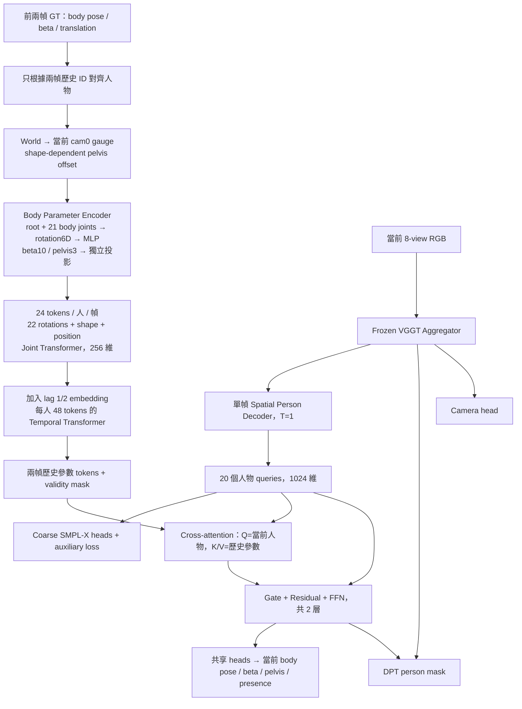

# 當前影像 + 前兩幀 GT SMPL-X 身體參數

`training/config/mamma_smpl_embedding_memory.yaml` 現在使用 `gt_body_parameters` 架構。
每個 sample 只有當前 frame 的 8-view RGB；前兩幀直接讀取 compose manifest 的
GT pose、beta、translation、gender、人物身分與有效性，不讀取它們的 RGB 或 mask。
訓練來源仍是 MAMMA + Harmony4D；validation 是 Harmony4D 的 10% sequence split。



## 身體範圍與座標

- 僅編碼 root + 21 個 SMPL-X body joints，共 66 個 axis-angle 數值；轉成 22 × 6
  的 rotation6D 表示。手指、下顎、眼球都沒有 encoder 分支。
- 為沿用 checkpoint 和 loss，輸出保留 `smpl_pose[...,72]`，尾端 6 維固定為零，
  不訓練它們；其他 SMPL-X hand/jaw/eye pose 在 body decoder 保持零。
- beta 使用現有 10 維。translation token 是當前 cam0 座標下的 pelvis 位置，
  不是直接拿 world-space `smpl_trans`。`prepare_gt_body_history` 先用身體模型取得
  shape-dependent pelvis offset，再轉換 root rotation、pelvis position。
- 前兩幀都使用當前第一台相機的外參與同一個 `avg_scale`，避免逐幀 gauge 不一致。
  本 config 使用 `normalize_cam: true`、`scale_by_extrinsics: false`。
- `gender` 只供 GT pelvis/body 幾何轉換，沒有作為 encoder token。

## 設計原因

| 模組 | 原因 |
| --- | --- |
| 各關節 MLP + part embedding | 區分關節，保留局部姿態；root、shape、位置用不同投影反映不同物理意義。 |
| Joint Transformer | 學習同一時間的關節關係，不在最初就壓成一個全身向量。 |
| Lag embedding + Temporal Transformer | 對同一個人的兩幀 tokens 學習先後與動作；不使用當前 GT。第一版使用 frame index，未編碼來源 FPS；混合 FPS 的動作時間尺度需另行校正。 |
| 全歷史 cross-attention | 當前 learned queries 不等於 GT person ID，讓模型根據當前影像和 SMPL/mask 監督學習從歷史集合檢索。歷史人物排列不影響輸出；沒有輸入當前 GT 身分的硬配對。 |
| Gate / residual | 控制歷史修正強度，gate bias 初始化 -2；兩幀都無效時精確回退 coarse 分支。歷史 dropout=0.1 模擬缺失。 |
| Null token + validity mask | 防止人物缺失時全遮罩 attention 產生 NaN；無效 padded 參數在數值運算前清零。 |
| 共享參數 heads + coarse auxiliary loss | 保留單幀辨識能力並 warm-start 原 checkpoint；coarse/refined 都由當前 GT 監督。 |

模型沒有讀取過去影像，也沒有讀取當前 GT pose/beta/位置/身分。資料載入器的歷史
person slots 只由前兩幀 ID 的 union 決定；不根據當前人物標籤選取歷史。
每個歷史 frame 都必須比 target 早；超過兩幀的歷史會被遮罩。

## Loss 與重投影

`L = L_current_multitask + 0.25 × L_current_coarse_SMPL`。

沿用 pose、beta、mesh translation、presence、joints2d、joints3d、vertices、DPT mask、
camera 的現有權重。Coarse 分支沒有 mask，只算幾何/presence，不重複算 camera。
參數 encoder 直接從當前 SMPL/geometry/mask loss 端到端訓練，沒有額外 reconstruction loss。

這個模型只預測當前一幀，所以 `loss.smpl.use_temporal_training: false`。Loader 的
`temporal_training.enabled: true` 仍用於取三個連續時間點，和 loss 的開關意義不同。
原本 pose/root/translation/beta temporal loss 權重設為 0。若歷史是精確 GT，
`(pred_t - GT_(t-1)) - (GT_t - GT_(t-1)) = pred_t - GT_t`，重複加入不提供新的時間資訊；
SO(3) 的相對旋轉 geodesic 誤差亦有相同的旋轉不變性。

重投影採一致的 pixel-center 定義：新模式直接以最終內參投影 GT 身體 joints，
避免 legacy track resize 的固定次像素偏移。`joints2d_use_exact_gt_intrinsics: true`
讓 GT-camera joints2d loss 直接使用完整 K/E，不經只保留 FoV 的相機編碼來回轉換，
以保留裁切後的主點。舊 config 預設維持原本的 loss 行為。

## 訓練與推論

```bash
cd /mnt/train-data-4-hdd/yian/Multi_SMPL/yian/M_embed_SPL_
CUDA_VISIBLE_DEVICES=2 PYTHONPATH=.:training \
/mnt/train-data-5-hdd/yian/anacond/envs/mamma/bin/torchrun \
  --standalone --nproc_per_node=1 training/launch.py \
  --config mamma_smpl_embedding_memory
```

每個 sample 現在只有 8 張影像，因此 `max_img_per_gpu: 40` 保留 B=5。
若設成 8，則 B=1。原程式的 `accum_steps` 是將同一個 loader batch 切成多份反傳，
不是跨多個 loader batches 累積；B=1 時不應設成 5。

Trainer 正常化相機後呼叫 `prepare_gt_body_history`，傳給模型的參數為：

```text
images                 [B,V,3,H,W]，只有當前影像
history_body_pose      [B,2,P,66]，root 在當前 cam0 gauge
history_body_beta      [B,2,P,10]
history_root_position  [B,2,P,3]，pelvis 在當前 cam0 gauge
history_valid          [B,2,P]
history_frame_ids      [B,2]
frame_ids              [B,1]
temporal_num_frames    [B]，全部是 1
views_per_frame        [B]
```

`model(images=images, smpl_inputs=...)` 回傳當前 `[B,20,...]` 預測。
推論時仍需提供相同定義的兩幀歷史參數；此 config 是 GT-history 訓練/驗證。
若實際部署改餵過去的模型預測，需另行訓練與評估預測歷史的誤差累積。
沒有因為 checkpoint 可載入，就宣稱新 encoder 已訓練完成。

## 測試

```bash
PYTHONPATH=.:training /mnt/train-data-5-hdd/yian/anacond/envs/mamma/bin/python \
  -m unittest discover -s tests -p 'test_gt_body_history.py' -v

CUDA_VISIBLE_DEVICES=2 PYTHONPATH=.:training \
PYTORCH_CUDA_ALLOC_CONF=expandable_segments:True \
/mnt/train-data-5-hdd/yian/anacond/envs/mamma/bin/python \
  debug/smoke_gt_body_history.py
```

整合測試會對 MAMMA、Harmony4D 各取真實資料，使用完整 518px / 8 views / 20 queries / DPT
架構，經實際 `Trainer._process_batch`、`Trainer._step` 計算 loss、backward、AdamW 更新。
另檢查只讀當前 8 張 RGB、history encoder 梯度、當前 GT 不洩漏、GT-as-pred loss、
current joints 重投影，及歷史 world 參數與轉換後 cam0 參數的 joints/vertices 幾何和投影一致性。

GT oracle 重投影驗證的是座標/幾何路徑正確，不能當作未訓練 encoder 的預測準確度。
報告及八視角 GT overlay 放在 `debug_outputs/gt_body_history_smoke/`。

### 實測結果（2026-09-16）

兩組來源各一個真實 sample，B=1、V=8、518px，載入 checkpoint_30，使用實際 Trainer
preprocess / step 與全部配置 loss，forward / backward / clipping / AdamW 都通過。
所有 encoder、fusion、spatial decoder、camera、mask 分支的梯度有限且非零，encoder
權重更新成功。每個 sample 僅讀取 8 張當前影像；改變當前 GT 不影響傳入模型的歷史參數。

| 項目 | MAMMA | Harmony4D |
| --- | --- | --- |
| Current GT joints 最大重投影誤差 | 0.000311 px | 0.000141 px |
| History joints 最大投影差 | 0.000503 px | 0.000162 px |
| History vertices 最大投影差 | 0.000696 px | 0.000195 px |
| GT-as-pred joints2d loss | 2.46e-7 | 1.54e-7 |
| GT-as-pred joints3d loss | 9.20e-8 | 7.43e-8 |
| GT-as-pred translation / vertices loss | 0 / 0 | 0 / 0 |
| 模型 objective | 0.567379 | 0.424437 |
| GPU peak allocated | 9.44 GiB | 11.41 GiB |

第二個來源沿用第一個 optimizer step 後的權重；objective 不用於資料集間的性能比較。
以上接近零的重投影是 GT oracle 的幾何檢查，新 encoder 的模型預測仍需正式訓練。
全套 26 項 unittest 通過，包括旋轉表示、有效性遮罩、歷史人物排列不變性、
拒絕當前/未來作為歷史、encoder 梯度與既有 temporal/mask 測試。
